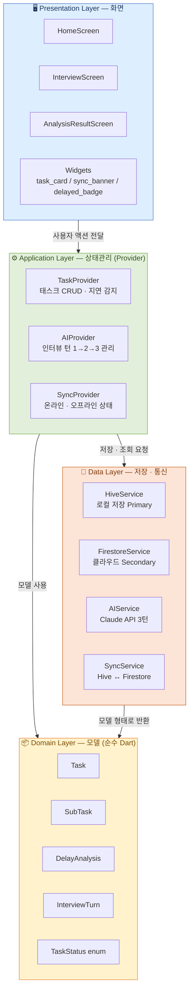
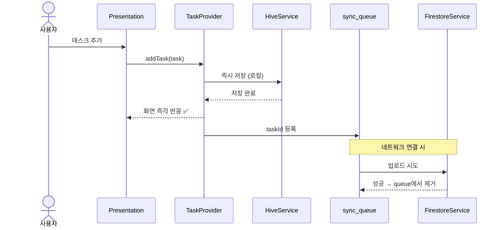
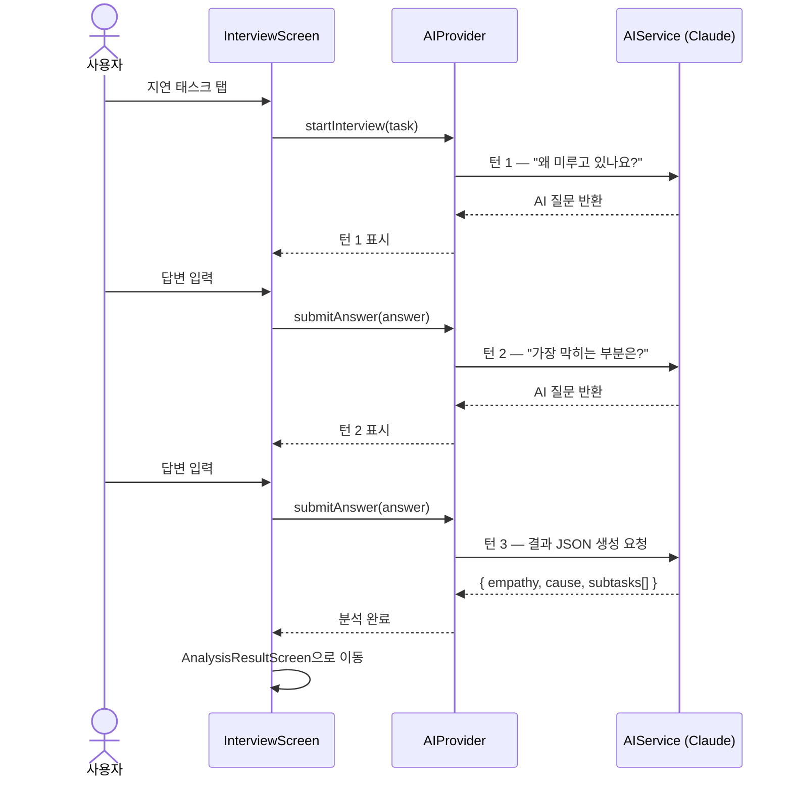

# Delay Detective — 아키텍처 문서

- **버전**: v1.0
- **작성일**: 2026-05-18
- **작성자**: 혜지

---

## 1. 레이어별 책임

| 레이어 | 한 줄 책임 | 폴더 |
|:---|:---|:---|
| **Presentation** | 사용자 눈에 보이는 화면과 입력을 담당한다 | `lib/presentation/` |
| **Application** | 화면과 데이터 사이에서 상태를 기억하고 명령을 전달한다 | `lib/application/` |
| **Domain** | 앱의 핵심 개념(태스크, 분석 결과)을 정의한다 | `lib/domain/` |
| **Data** | 실제 저장·통신을 담당한다 (Hive, Firebase, Claude API) | `lib/data/` |

> **규칙**: 의존 방향은 위에서 아래로만 흐른다.  
> `Presentation → Application → Domain ← Data`  
> Domain은 아무것도 import하지 않는 순수 Dart 클래스다.

---

## 2. 핵심 기능 3개 × 레이어 흐름

| 핵심 기능 | Domain | Data | Application | Presentation |
|:---|:---:|:---:|:---:|:---:|
| **지연 감지** | `Task.isDelayed` 규칙 정의 | `HiveService`로 태스크 조회 | `TaskProvider.checkDelayStatus()` | 빨간 배지 · 상단 정렬 |
| **AI 인터뷰** | `InterviewTurn` 모델 | `AIService` → Claude API 호출 | `AIProvider` 턴 1→2→3 관리 | `InterviewScreen` 채팅 UI |
| **태스크 재구성** | `SubTask` 모델 (15분 단위) | `HiveService`에 소태스크 저장 | `TaskProvider.applySubtasks()` | `AnalysisResultScreen` |

---

## 3. 아키텍처 다이어그램



---

## 4. 데이터 흐름 — Offline-First 전략



---

## 5. AI 인터뷰 흐름 — 3턴 고정



---

## 6. Firestore 스키마

```
users/
  {uid}/                         ← Firebase 익명 UID
    tasks/
      {taskId}/
        title        : string
        description  : string | null
        dueDate      : timestamp | null
        status       : "todo" | "inProgress" | "delayed" | "done"
        isDelayed    : boolean
        createdAt    : timestamp
        updatedAt    : timestamp    ← Conflict Resolution 기준
        subtasks     : [            ← 배열 (별도 컬렉션 X)
          { id, title, isDone }
        ]
        analysis     : {            ← null = 미분석
          empathyMessage : string
          causeSummary   : string
          analyzedAt     : timestamp
          turns          : [{ turnNumber, question, answer }]
        } | null
```

---

## 7. 핵심 결정 요약

| 결정 항목 | 선택 | 이유 |
|:---|:---|:---|
| 플랫폼 | Flutter | 단일 코드로 Android/iOS 동시 지원 |
| 상태관리 | Provider (ChangeNotifier) | Flutter 공식 권장, 학습 진입장벽 낮음 |
| 로컬 저장 | Hive (Primary) | 오프라인에서도 100% 동작 |
| 클라우드 | Firestore (Secondary) | 백그라운드 동기화, 무료 플랜 |
| 로그인 | Firebase 익명 로그인 | 계정 없이 바로 사용, 나중에 계정 연결 가능 |
| AI | Claude API 3턴 고정 | 비용 예측 가능, 상태 관리 단순 |
| 소태스크 저장 | Task 서브필드 배열 | 별도 컬렉션 대비 쿼리 단순화 |
| 알림 | 로컬 알림만 | FCM 대비 구현 복잡도 1/10 |

---

*관련 ADR: [ADR-0001](../decisions/ADR-0001-mobile-framework.md) · [ADR-0002](../decisions/ADR-0002-state-management.md) · [ADR-0003](../decisions/ADR-0003-backend-choice.md)*
