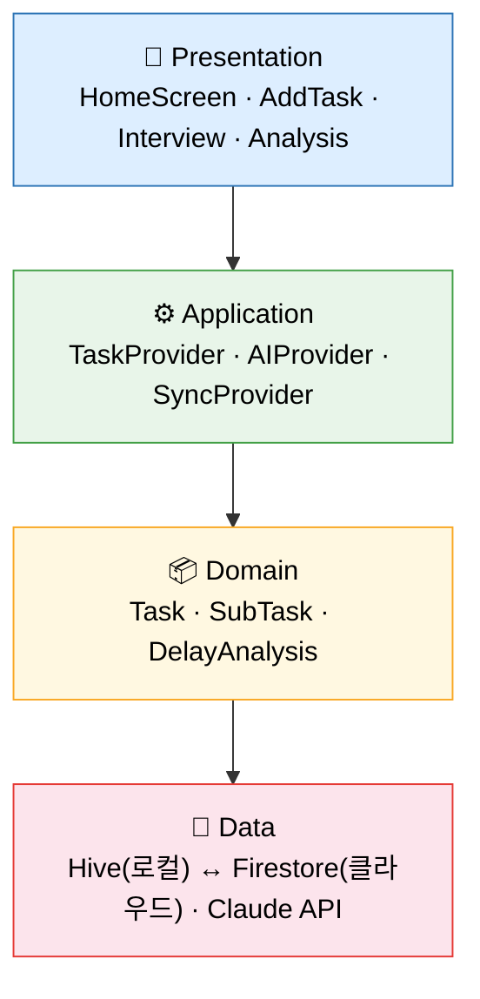
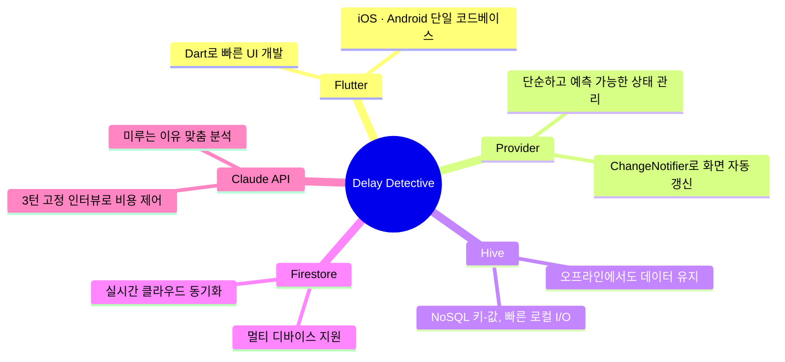

<!-- _class: cover -->

# 🔍 Delay Detective
### AI 기반 미루기 분석 & 태스크 재구성 앱

<br>

**중간 발표 — 12주차**
혜지 | Flutter · Claude API · Firebase

---

## 문제 & 솔루션 　　　　　　　　　　

> "할 일은 있는데… 왜 시작이 안 되지?"

기존 투두 앱은 **미룬 이유를 분석하지 않는다.**

<br>

**Delay Detective** 는 3단계로 해결한다.

| 단계 | 기능 |
|:---:|:---|
| 1️⃣ 감지 | 마감 초과 태스크를 자동으로 찾아낸다 |
| 2️⃣ 분석 | Claude AI가 3턴 인터뷰로 미루는 이유를 파악한다 |
| 3️⃣ 재구성 | 15분 단위 소태스크 3개로 쪼개서 제시한다 |

---

## 핵심 기능 3개 　　　　　　　　　　　　

**① 지연 감지**
마감일 초과 → 자동으로 🔴 빨간 배지 + 홈 화면 상단 고정

**② AI 인터뷰 (Claude API, 3턴 고정)**
```
턴 1: "왜 미루고 있나요?"
턴 2: "가장 막히는 부분이 뭔가요?"
턴 3: 공감 메시지 + 원인 요약 + 소태스크 생성
```

**③ 태스크 재구성**
"발표 자료 만들기" → ☐ 목차만 잡기 · ☐ 첫 장 쓰기 · ☐ 자료 1개 찾기

---

## 아키텍처 — 4-레이어 구조



---

## 기술 스택 — 왜 선택했는지



---

## 남은 계획 & 마무리 　　　　　　　　　

**12주차 남은 목표 (이번 주)**
- HiveService 구현 → 태스크 CRUD 동작
- Claude API 연결 → 인터뷰 2턴 확인
- HomeScreen · InterviewScreen 연결

<br>

**13~14주차**
알림 · 지연 감지 고도화 → QA → 최종 발표 준비

<br>

> 오늘 목표: 태스크 추가 → 지연 감지 → AI 인터뷰 **전체 흐름 시연**
